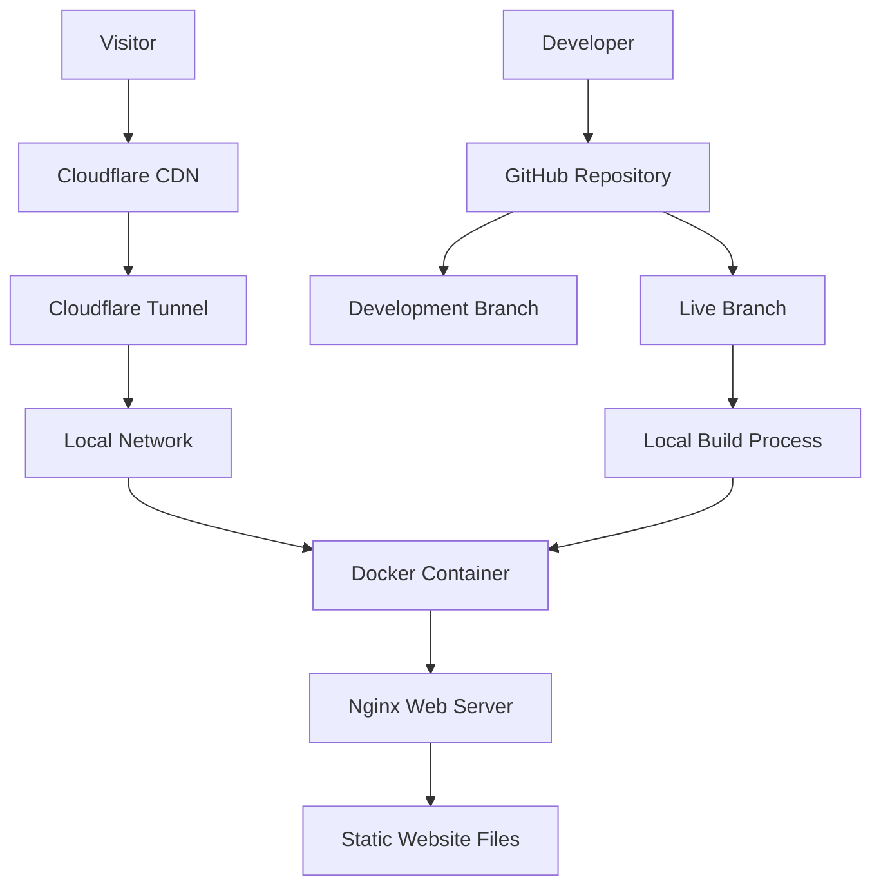

# Design Document

## Overview

The personal website website will be a modern, responsive single-page application that showcases professional information through a polished interface. The architecture follows a containerized approach using Docker for consistent deployment, with public accessibility through Cloudflare tunnels. The design emphasizes performance, accessibility, and mobile-first responsive design principles.

## Architecture

### High-Level Architecture



### Technology Stack

- **Frontend**: HTML5, CSS3 (with CSS Grid/Flexbox), Vanilla JavaScript (ES6+)
- **Web Server**: Nginx (lightweight, high-performance)
- **Containerization**: Docker with multi-stage builds
- **Deployment**: Cloudflare Tunnel + Local Docker hosting
- **Version Control**: Git with GitHub (development/live branch strategy)

### Deployment Flow

1. Code development on `development` branch
2. Testing and validation locally
3. Merge to `live` branch when ready for production
4. Automated Docker build process
5. Container deployment with Cloudflare tunnel routing

## Components and Interfaces

### Frontend Components

#### 1. Header Section
- **Purpose**: Primary introduction and navigation
- **Elements**: Name, professional title, navigation menu (if needed)
- **Responsive Behavior**: Stacks vertically on mobile, horizontal on desktop

#### 2. Hero Section
- **Purpose**: Main visual impact and introduction
- **Elements**: Professional photo/avatar, tagline, brief introduction
- **Animations**: Smooth fade-in, subtle parallax effects
- **Responsive Behavior**: Single column on mobile, side-by-side on desktop

#### 3. About Section
- **Purpose**: Detailed personal and professional information
- **Elements**: Bio text, skills, interests
- **Layout**: Card-based design with clean typography
- **Responsive Behavior**: Stacked cards on mobile, grid layout on desktop

#### 4. Footer Section
- **Purpose**: Contact information and social links
- **Elements**: Email, social media links, copyright
- **Responsive Behavior**: Centered on mobile, distributed on desktop

### CSS Architecture

```
styles/
├── base/
│   ├── reset.css          # CSS reset/normalize
│   ├── typography.css     # Font definitions and text styles
│   └── variables.css      # CSS custom properties
├── components/
│   ├── header.css         # Header component styles
│   ├── hero.css           # Hero section styles
│   ├── about.css          # About section styles
│   └── footer.css         # Footer component styles
├── layout/
│   ├── grid.css           # Grid system
│   └── responsive.css     # Media queries and responsive utilities
└── main.css               # Main stylesheet that imports all others
```

### JavaScript Architecture

```
scripts/
├── utils/
│   ├── animations.js      # Animation utilities
│   └── responsive.js      # Responsive behavior helpers
├── components/
│   ├── navigation.js      # Navigation interactions
│   └── smooth-scroll.js   # Smooth scrolling behavior
└── main.js                # Main application entry point
```

## Data Models

### Site Configuration
```javascript
const siteConfig = {
  personal: {
    name: "Your Name", //ItzDevoo
    title: "Professional Title",
    bio: "Brief professional bio",
    email: "contact@itzdevoo.com",
    social: {
      github: "username",
      youtube: "url",
      // other social links
    }
  },
  theme: {
    primaryColor: "#color", //Black
    secondaryColor: "#color", //Lime Green
    fontFamily: "font-stack"
  },
  features: {
    smoothScrolling: true,
    animations: true,
    darkMode: false // future enhancement
  }
}
```

### Responsive Breakpoints
```css
:root {
  --breakpoint-mobile: 320px;
  --breakpoint-tablet: 768px;
  --breakpoint-desktop: 1024px;
  --breakpoint-large: 1440px;
}
```

## Error Handling

### Frontend Error Handling
- **Image Loading**: Fallback images for profile photos
- **Animation Failures**: Graceful degradation for older browsers
- **Network Issues**: Offline-friendly design with cached resources

### Container Error Handling
- **Port Conflicts**: Configurable port mapping
- **Resource Limits**: Memory and CPU constraints
- **Health Checks**: Container health monitoring

### Cloudflare Tunnel Error Handling
- **Connection Failures**: Retry mechanisms
- **SSL Certificate Issues**: Automatic certificate management
- **DNS Resolution**: Fallback routing strategies

## Testing Strategy

### Frontend Testing
- **Cross-browser Compatibility**: Chrome, Firefox, Safari, Edge
- **Device Testing**: Mobile phones, tablets, desktop screens
- **Performance Testing**: Lighthouse audits, Core Web Vitals
- **Accessibility Testing**: Screen readers, keyboard navigation, color contrast

### Container Testing
- **Build Testing**: Verify Docker image builds successfully
- **Runtime Testing**: Container starts and serves content correctly
- **Resource Testing**: Memory and CPU usage within acceptable limits
- **Security Testing**: Container vulnerability scanning

### Integration Testing
- **Tunnel Testing**: Verify public accessibility through Cloudflare
- **SSL Testing**: HTTPS certificate validation
- **Performance Testing**: End-to-end load times and responsiveness

## Security Considerations

### Frontend Security
- **Content Security Policy**: Strict CSP headers
- **XSS Prevention**: Input sanitization (if forms added later)
- **HTTPS Enforcement**: All resources served over HTTPS

### Container Security
- **Minimal Base Image**: Alpine Linux for reduced attack surface
- **Non-root User**: Run processes as non-privileged user
- **Read-only Filesystem**: Immutable container filesystem where possible

### Network Security
- **Cloudflare Protection**: DDoS protection and WAF
- **Rate Limiting**: Request throttling
- **Secure Headers**: HSTS, X-Frame-Options, etc.

## Performance Optimization

### Frontend Performance
- **Asset Optimization**: Minified CSS/JS, optimized images
- **Lazy Loading**: Images and non-critical resources
- **Critical CSS**: Inline critical path CSS
- **Resource Hints**: Preload, prefetch for key resources

### Container Performance
- **Multi-stage Builds**: Minimal production image
- **Nginx Optimization**: Gzip compression, caching headers
- **Resource Limits**: Appropriate CPU/memory allocation

### Network Performance
- **Cloudflare CDN**: Global content distribution
- **HTTP/2**: Modern protocol support
- **Compression**: Brotli/Gzip for text resources

## Accessibility Features

### WCAG Compliance
- **Semantic HTML**: Proper heading hierarchy, landmarks
- **Keyboard Navigation**: Full keyboard accessibility
- **Screen Reader Support**: ARIA labels and descriptions
- **Color Contrast**: WCAG AA compliance for all text
- **Focus Management**: Visible focus indicators
- **Alternative Text**: Descriptive alt text for images

### Progressive Enhancement
- **Core Functionality**: Works without JavaScript
- **Enhanced Experience**: JavaScript adds smooth interactions
- **Fallback Support**: Graceful degradation for older browsers